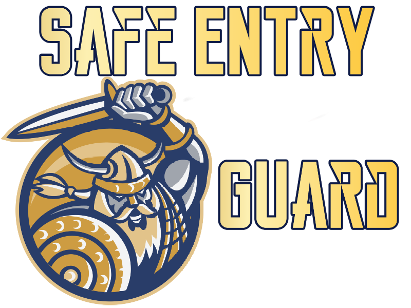

# Safe Entry Guard Mod for Project Zomboid

## Table of Contents

- [Disclaimer](#disclaimer)
- [Description](#description)
- [Installation](#installation)
- [Sandbox Options](#sandbox-options)
- [Differences from Other Mods](#differences-from-other-mods)
- [Credits](#credits)
- [License: Fair Use & Agreement](#license-fair-use--agreement)

## Disclaimer

:warning: **This mod is still under active development.** While we strive to provide stability, users may still encounter unforeseen issues or variations in functionality. It's advised to backup your saves and game data prior to use. Your feedback and bug reports are invaluable to us.

## Description

The Safe Entry Guard Mod ensures players have a buffer of protection when initiating the game, granting a moment to acclimate before potentially confronting a zombie onslaught.

### **Key Features:**

1. **Triple-layer Protection**: Safe Entry Guard goes above and beyond by offering three layers of security - player invisibility, preventing zombies from attacking and Ghost Mode.

2. **Dynamic Duration**: The protection period dynamically adjusts when the player moves during the safety period. This adjustment relies on a sandbox-defined multiplier.

3. **Sandbox Customization**: A seamless integration into the game's sandbox options, letting players dictate the mod's behavior to suit their gameplay style.

## Installation

1. Secure a copy of the Safe Entry Guard mod.
2. Transfer the mod contents into the `Project Zomboid/mods/` directory.
3. Fire up the game, venture to mods, and activate "Safe Entry Guard".
4. Adjust sandbox settings as per your requirements.

## Sandbox Options

- **Protection Duration**: Designate the protective period (in seconds) upon game entry. This time frame reduces if the player decides to move.

- **Movement Duration Multiplier**: Assign the multiplier to determine the protective span if the player mobilizes. For instance, 0.5 signifies halving the time upon movement.

- **Use Invisibility**: Option to trigger the invisibility feature throughout the protection phase.

## Differences from Other Mods

While many mods utilize invisibility or a "ghost mode", they often falter due to irregular executions. Safe Entry Guard sets itself apart by:

- Providing a robust triple-layered defense mechanism.
- Allowing users to tweak sandbox settings, tailoring a unique gaming experience.

## Credits

- **Author**: Hazy Lunar

For any queries, propositions, or potential partnerships, reach out to [Hazy Lunar](https://ko-fi.com/hazylunar).

**Support & Donations**: Stand by Hazy Lunar. They're up for mod commissions at a reasonable fee under $50, contingent on the mod's intricacy. Extend your support [here](https://ko-fi.com/hazylunar).

## License: Fair Use & Agreement

"Safe Entry Guard" mod stands as open-source software, available to all for use, adapt, and distribution. Should you decide to employ or cite this mod in your endeavors:

1. **Offer Credit**: Attribute "Safe Entry Guard" as the genesis and render due recognition to its creator, Hazy Lunar.
  
2. **Provide Links**: Incorporate links to the foundational GitHub repository: [HazyLunar's GitHub](https://github.com/HazyLunar) and its Steam Workshop Collection: [Safe Entry Guard on Steam Workshop](https://steamcommunity.com/workshop/filedetails/?id=3018173209).

By opting to use or reference this mod, you commit to the aforestated citations. While this isn't a binding legal requisite, it stands as a testament to goodwill and homage to the dedication and time expended by the original developer.
